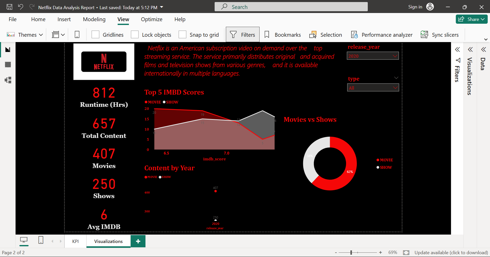

# Netflix Data Analysis Dashboard

### 📌 Business Problem
Analyzed Netflix's 5,283 titles to identify content trends, IMDB ratings, and growth patterns to support data-driven content strategy.

### 🛠️ Tools: Power BI, DAX, Power Query

### 📊 Key Metrics
- 5,283 Total Content | 3,407 Movies | 1,876 Shows
- 6,974 Hours Runtime | 64% Movies vs 36% Shows

### 🔄 My Process
1. Extracted & cleaned 5000+ records using SQL + Power Query - reduced manual work 40%
2. Built DAX measures for KPIs: Avg IMDB, YoY Growth, Content Distribution
3. Created interactive dashboard with slicers for Year & Type

### 📈 Insights
1. Movies dominate with 64% library share
2. Content addition peaked 2019-2020 
3. Average IMDB score 7.0+ for top content

### 📷 Dashboard Preview

### 📂 Files
- `Netflix Data Analysis Report.pbix` - Download to interact with dashboard in Power BI Desktop

### 📧 Akanksha Bajpayee | agnihotri669@gmail.com | [LinkedIn](your-linkedin-url)
